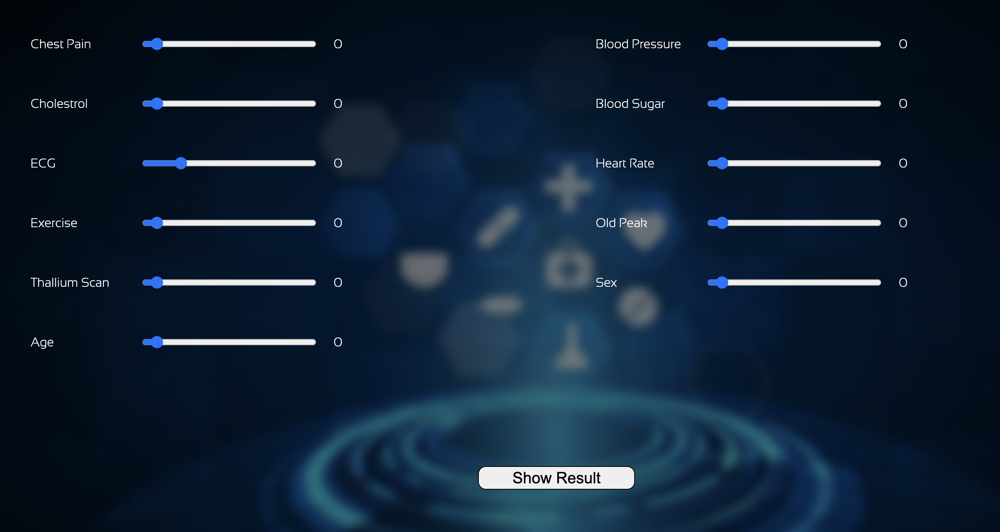

# Heart Disease Detection

In this project we recognize heart disease using fuzzy systems

1. Fuzzification input number to fuzzy values to use them with fuzzy rules we have.

2. Implementing inference engine fuzzy rules in this [file]().

3. Defuzzification fuzzy output to a real number using center of mass algorithm.

Run this project using:

```
python3 -m venv env
source env/bin/activate
pip3 install -r requirements.txt
python3 app.py
```

Inputs:



Outputs:


